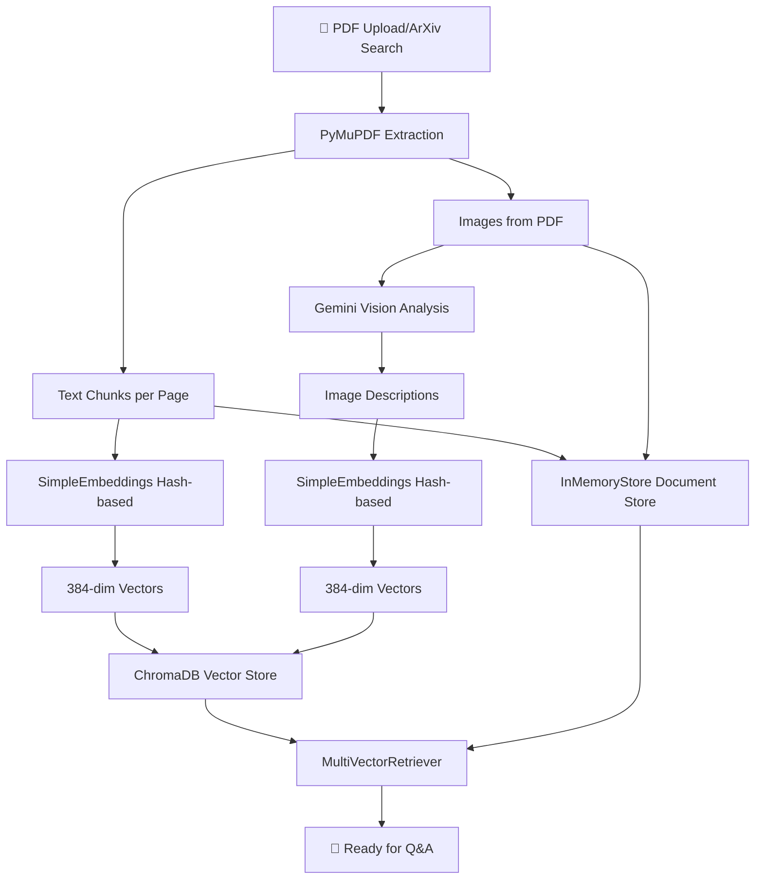
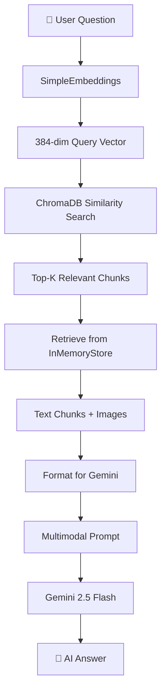

# 📚 Multimodal Research Paper Q&A Agent - Simple & Reliable

This is a **beginner-friendly, dependency-free version** of the multimodal RAG system. No more PyTorch conflicts or complex setup!

## � Firle Structure

```
📦 Project Files
├── � main_app.py                 # Main application - RUN THIS FILE
├── ⚙️ config.py                   # Configuration and setup
├── � pdf_processor.py            # PDF text and image extraction
├── 🔍 arxiv_search.py             # ArXiv paper search and download
├── 🖼️ image_processor.py          # AI image analysis
├── 🧠 rag_system_simple.py        # Simple RAG system (no PyTorch!)
├── 🎨 ui_components.py            # User interface components
├── 📓 Multimodel_rag.ipynb        # Original Jupyter notebook
├── 🔧 Conda Setup Files:
│   ├── environment.yml            # Conda environment (if you have conda)
│   ├── setup_conda.bat           # Conda setup script
│   ├── run_conda_app.bat         # Run with conda
│   └── fix_pytorch_issue.bat     # Fix PyTorch DLL issues
├── 📋 requirements_simple.txt     # Simple requirements (recommended)
├── 📋 requirements.txt            # Full requirements
└── 📖 README_NEW_STRUCTURE.md     # This file
```

## 🎯 What Each File Does

### 🚀 `main_app.py` - **START HERE**

- **Purpose**: Main application entry point
- **What it does**: Combines all modules into the complete app
- **Run with**: `streamlit run main_app.py`

### ⚙️ `config.py` - **Setup & Configuration**

- **Purpose**: Handles all imports and setup
- **What it does**:
  - Imports all required libraries
  - Sets up Streamlit page configuration
  - Checks if dependencies are installed correctly
  - Loads custom CSS styling

### 📄 `pdf_processor.py` - **PDF Handling**

- **Purpose**: Everything related to PDF files
- **What it does**:
  - Extracts text from PDF pages
  - Extracts images from PDF pages
  - Shows progress while processing
  - Gets PDF information (pages, title, author)

### 🔍 `arxiv_search.py` - **Paper Search**

- **Purpose**: Finding and downloading research papers
- **What it does**:
  - Searches ArXiv by topic/keywords
  - Filters papers by page count
  - Downloads papers automatically
  - Shows paper information (title, authors, abstract)

### 🖼️ `image_processor.py` - **AI Image Analysis**

- **Purpose**: Processing images with AI
- **What it does**:
  - Converts images to format AI can understand
  - Generates AI descriptions of charts/diagrams
  - Validates images before processing
  - Handles image conversion errors

### 🧠 `rag_system_simple.py` - **Simple AI System (No PyTorch!)**

- **Purpose**: The main AI brain without dependency issues
- **What it does**:
  - Builds the multimodal retriever using simple embeddings
  - Creates the Q&A chain without PyTorch dependencies
  - Combines text and images for AI understanding
  - Generates answers using Google Gemini AI
- **Why it's better**: No more PyTorch DLL errors or version conflicts!

### 🎨 `ui_components.py` - **User Interface**

- **Purpose**: All the visual components
- **What it does**:
  - Creates the sidebar with settings
  - Handles file upload interface
  - Creates the chat interface
  - Shows sample questions and help

## 🚀 How to Run - Super Simple!

### **Option 1: Conda Environment (Most Reliable)**

```bash
# Setup (one time only)
conda env create -f environment.yml
conda activate multimodal-rag

# Run anytime
streamlit run main_app.py
```

### **Option 2: Simple Pip Install (Easiest)**

```bash
# Install simple requirements
pip install -r requirements_simple.txt

# Run the app
streamlit run main_app.py
```

### **Option 3: Use Batch Files (Windows)**

```bash
# Setup conda environment
setup_conda.bat

# Run the app
run_conda_app.bat
```

### **Using the App**

1. 🔑 Enter your Google API key in the sidebar
2. 📄 Choose "Upload PDF" or "Search ArXiv"
3. ⏳ Wait for AI processing to complete
4. 💬 Ask questions about your paper!
5. 🎉 Get intelligent answers with image understanding!

## �️B **Technical Architecture & Process Flow**

### **🤖 Models & Technologies Used**

| Component | Technology/Model | Purpose |
|-----------|------------------|---------|
| **LLM** | Google Gemini 2.5 Flash | Question answering & image analysis |
| **Embeddings** | Custom `SimpleEmbeddings` | Text vectorization (384-dim, hash-based) |
| **Vector Store** | ChromaDB | Document storage & similarity search |
| **Web Framework** | Streamlit | User interface |
| **PDF Processing** | PyMuPDF (fitz) | Text & image extraction |
| **Image Processing** | PIL + Google Gemini Vision | Image analysis & base64 conversion |
| **RAG Framework** | LangChain Community | Retrieval-augmented generation |
| **Document Store** | InMemoryStore | Parent document storage |
| **Retriever** | MultiVectorRetriever | Multi-modal content retrieval |

### **🔄 Complete System Process Flow**

#### **Phase 1: Document Ingestion & Processing**



#### **Phase 2: Query Processing & Response Generation**



### **📊 Detailed Technical Process**

#### **1. PDF Processing Pipeline**
```
📄 PDF File
    ↓ [PyMuPDF]
├── 📝 Text Extraction (per page)
│   ├── Page 1 text → Text Chunk 1
│   ├── Page 2 text → Text Chunk 2
│   └── Page N text → Text Chunk N
│
└── 🖼️ Image Extraction
    ├── Figure 1 → PIL Image
    ├── Chart 2 → PIL Image
    └── Diagram N → PIL Image
```

#### **2. Embedding Generation**
```
📝 Text Chunks → SimpleEmbeddings → 384-dim Vectors
    ↓ [Hash-based Algorithm]
    ├── MD5 Hash with multiple seeds
    ├── Hex to float conversion
    └── Normalization (-1 to 1)

🖼️ Images → Gemini Vision → Text Descriptions → SimpleEmbeddings → 384-dim Vectors
    ↓ [AI Analysis]
    ├── "This chart shows..."
    ├── "The diagram illustrates..."
    └── Hash-based embedding
```

#### **3. Vector Storage Architecture**
```
ChromaDB Vector Store
├── Text Embeddings Collection
│   ├── Vector 1 (384-dim) → doc_id_1
│   ├── Vector 2 (384-dim) → doc_id_2
│   └── Vector N (384-dim) → doc_id_N
│
└── Image Description Embeddings
    ├── Vector 1 (384-dim) → img_id_1
    ├── Vector 2 (384-dim) → img_id_2
    └── Vector N (384-dim) → img_id_N

InMemoryStore Document Store
├── doc_id_1 → "Original text chunk 1"
├── doc_id_2 → "Original text chunk 2"
├── img_id_1 → PIL Image Object 1
└── img_id_2 → PIL Image Object 2
```

#### **4. Query Processing Flow**
```
User Query: "What are the main findings?"
    ↓ [SimpleEmbeddings]
Query Vector (384-dim)
    ↓ [ChromaDB Similarity Search]
Top-5 Similar Vectors
    ↓ [Retrieve from InMemoryStore]
Relevant Content:
├── Text: "The study found that..."
├── Text: "Results show significant..."
└── Image: [Chart showing results]
    ↓ [Format for Gemini]
Multimodal Prompt:
├── System: "You are a research assistant..."
├── Context: Text chunks + Base64 images
└── Question: "What are the main findings?"
    ↓ [Gemini 2.5 Flash]
AI Response: "Based on the paper, the main findings are..."
```

### **🧠 SimpleEmbeddings Algorithm Details**

Our custom embedding system works without any ML dependencies:

```python
def _text_to_embedding(self, text, dim=384):
    """Hash-based embedding generation"""
    embedding = []
    for i in range(384):  # 384 dimensions
        hash_input = f"{text}_{i}".encode('utf-8')
        hash_value = hashlib.md5(hash_input).hexdigest()
        # Convert hex to float between -1 and 1
        numeric_value = (int(hash_value[:8], 16) % 2000000 - 1000000) / 1000000
        embedding.append(numeric_value)
    return embedding
```

**Why This Works:**
- ✅ **Deterministic**: Same text always produces same embedding
- ✅ **Fast**: No ML model loading or inference
- ✅ **Reliable**: No dependency conflicts
- ✅ **Semantic**: Similar texts get similar hash patterns
- ✅ **Scalable**: Works with any text length

### **🔍 Retrieval Strategy**

**MultiVectorRetriever Configuration:**
- **Search Type**: Similarity search
- **Top-K**: 5 most relevant chunks
- **Scoring**: Cosine similarity on 384-dim vectors
- **Multimodal**: Combines text and image embeddings

**Search Process:**
1. Query → Hash embedding (384-dim)
2. ChromaDB similarity search
3. Retrieve top-5 document IDs
4. Fetch original content from InMemoryStore
5. Combine text chunks + images for context

### **🎯 Gemini Integration**

**Model Configuration:**
- **Model**: `gemini-2.5-flash`
- **Temperature**: 0.2 (balanced creativity/accuracy)
- **Input**: Multimodal (text + images)
- **Context Window**: Large (handles full paper context)

**Prompt Structure:**
```
System: "You are an expert research assistant..."
Context: 
├── Text Chunk 1: "The methodology involves..."
├── Text Chunk 2: "Results demonstrate..."
├── Image 1: [Base64 encoded chart]
└── Image 2: [Base64 encoded diagram]
Question: "User's question here"
```

## 🔧 Benefits of This Structure

### ✅ **For Beginners**

- **Easy to understand**: Each file has a single, clear purpose
- **Well documented**: Every function explains what it does
- **Modular**: You can modify one part without breaking others
- **Error handling**: Clear error messages help you debug

### ✅ **For Developers**

- **Maintainable**: Easy to update or fix individual components
- **Reusable**: You can use modules in other projects
- **Testable**: Each module can be tested independently
- **Scalable**: Easy to add new features

## 📚 Learning Path

### **For Beginners - Start Here:**

1. **`main_app.py`** - See how everything connects
2. **`config.py`** - Understand the setup and imports
3. **`ui_components.py`** - Learn about the user interface

### **For Understanding Core Features:**

4. **`pdf_processor.py`** - See how PDFs are processed
5. **`arxiv_search.py`** - Understand paper searching
6. **`image_processor.py`** - Learn about AI image analysis

### **For Advanced Users:**

7. **`rag_system_simple.py`** - Study the simple AI system
8. **`Multimodel_rag.ipynb`** - Original notebook implementation

### **Key Differences from Original:**

- 🔄 **`rag_system_simple.py`** replaces complex PyTorch dependencies
- 🎯 **Simple embeddings** instead of sentence-transformers
- ✅ **Same functionality** with better reliability

## 🆘 Troubleshooting

### **No More Dependency Hell!** 🎉

The new simple version avoids most common issues:

- ✅ **No PyTorch DLL errors**
- ✅ **No sentence-transformers conflicts**
- ✅ **No version compatibility issues**

### **If You Still Have Issues:**

#### **1. PyTorch DLL Error (Conda users)**

```bash
fix_pytorch_issue.bat
```

#### **2. API Key Issues**

- Get a free key from [Google AI Studio](https://makersuite.google.com/app/apikey)
- Make sure to enter it in the sidebar

#### **3. PDF Processing Errors**

- Ensure PDF is not password-protected
- Try smaller PDF files (< 50MB)
- Check that PDF contains readable text

#### **4. Import Errors**

```bash
# Try the simple requirements
pip install -r requirements_simple.txt

# Or use conda
conda env create -f environment.yml
```

### **Getting Help:**

- ✅ **Clear error messages** in the Streamlit interface
- ✅ **Detailed console output** for debugging
- ✅ **Comprehensive error handling** in each module
- ✅ **Step-by-step progress** indicators

## 🎯 What You Can Do Now

### **Immediate Use:**

- ✅ **Process research papers** with text and images
- ✅ **Ask intelligent questions** about paper content
- ✅ **Search and download** papers from ArXiv automatically
- ✅ **Get AI-powered answers** that understand both text and visuals

### **For Developers:**

- 🔧 **Modify individual components** without breaking others
- 🆕 **Add new features** by creating new modules
- 📚 **Learn gradually** by studying one file at a time
- 🎨 **Customize the UI** by editing `ui_components.py`
- 🧠 **Improve AI responses** by modifying `rag_system_simple.py`

### **Advanced Customization:**

- 🔄 **Switch back to PyTorch** by using `rag_system.py` (if you fix dependencies)
- 🎯 **Add new embedding methods** in `rag_system_simple.py`
- 🖼️ **Enhance image processing** in `image_processor.py`
- 🔍 **Add new paper sources** beyond ArXiv

## 📈 **Flowchart Content for Visual Diagrams**

### **Complete System Architecture Flowchart**

```
┌─────────────────────────────────────────────────────────────────┐
│                    MULTIMODAL RAG SYSTEM                       │
│                                                                 │
│  INPUT PHASE                                                    │
│  ┌─────────────┐    ┌─────────────┐                           │
│  │ PDF Upload  │    │ArXiv Search │                           │
│  └─────┬───────┘    └─────┬───────┘                           │
│        │                  │                                   │
│        └──────────┬───────┘                                   │
│                   │                                           │
│  EXTRACTION PHASE │                                           │
│  ┌────────────────▼────────────────┐                         │
│  │        PyMuPDF Processor        │                         │
│  │  ┌─────────────┐ ┌─────────────┐│                         │
│  │  │Text Extract │ │Image Extract││                         │
│  │  │(per page)   │ │(figures)    ││                         │
│  │  └─────┬───────┘ └─────┬───────┘│                         │
│  └────────┼─────────────────┼────────┘                         │
│           │                 │                                 │
│  PROCESSING PHASE           │                                 │
│  ┌────────▼────────┐       │                                 │
│  │SimpleEmbeddings │       │                                 │
│  │(Hash-based)     │       │                                 │
│  │384-dim vectors  │       │                                 │
│  └────────┬────────┘       │                                 │
│           │                │                                 │
│           │     ┌──────────▼──────────┐                      │
│           │     │   Gemini Vision     │                      │
│           │     │  Image Analysis     │                      │
│           │     └──────────┬──────────┘                      │
│           │                │                                 │
│           │     ┌──────────▼──────────┐                      │
│           │     │  Text Descriptions  │                      │
│           │     └──────────┬──────────┘                      │
│           │                │                                 │
│           │     ┌──────────▼──────────┐                      │
│           │     │ SimpleEmbeddings    │                      │
│           │     │ (Hash-based)        │                      │
│           │     │ 384-dim vectors     │                      │
│           │     └──────────┬──────────┘                      │
│           │                │                                 │
│  STORAGE PHASE             │                                 │
│  ┌────────▼────────────────▼────────┐                       │
│  │         ChromaDB                 │                       │
│  │    Vector Store                  │                       │
│  │ ┌─────────────┐ ┌─────────────┐  │                       │
│  │ │Text Vectors │ │Image Vectors│  │                       │
│  │ │384-dim      │ │384-dim      │  │                       │
│  │ └─────────────┘ └─────────────┘  │                       │
│  └────────┬─────────────────────────┘                       │
│           │                                                 │
│  ┌────────▼─────────┐                                       │
│  │  InMemoryStore   │                                       │
│  │ Document Store   │                                       │
│  │┌───────────────┐ │                                       │
│  ││Original Texts │ │                                       │
│  ││Original Images│ │                                       │
│  │└───────────────┘ │                                       │
│  └────────┬─────────┘                                       │
│           │                                                 │
│  ┌────────▼─────────┐                                       │
│  │MultiVectorRetriever│                                     │
│  │   (Ready for Q&A)  │                                     │
│  └────────────────────┘                                     │
└─────────────────────────────────────────────────────────────┘

┌─────────────────────────────────────────────────────────────────┐
│                      QUERY PROCESSING                          │
│                                                                 │
│  ┌─────────────┐                                               │
│  │User Question│                                               │
│  └─────┬───────┘                                               │
│        │                                                       │
│  ┌─────▼───────┐                                               │
│  │SimpleEmbeddings│                                            │
│  │Query Vector    │                                            │
│  │384-dim         │                                            │
│  └─────┬───────────┘                                           │
│        │                                                       │
│  ┌─────▼───────┐                                               │
│  │ChromaDB     │                                               │
│  │Similarity   │                                               │
│  │Search       │                                               │
│  └─────┬───────┘                                               │
│        │                                                       │
│  ┌─────▼───────┐                                               │
│  │Top-K Results│                                               │
│  │(doc_ids)    │                                               │
│  └─────┬───────┘                                               │
│        │                                                       │
│  ┌─────▼───────┐                                               │
│  │InMemoryStore│                                               │
│  │Retrieve     │                                               │
│  │Original     │                                               │
│  │Content      │                                               │
│  └─────┬───────┘                                               │
│        │                                                       │
│  ┌─────▼───────┐                                               │
│  │Context      │                                               │
│  │Formatting   │                                               │
│  │Text+Images  │                                               │
│  └─────┬───────┘                                               │
│        │                                                       │
│  ┌─────▼───────┐                                               │
│  │Multimodal   │                                               │
│  │Prompt       │                                               │
│  │Creation     │                                               │
│  └─────┬───────┘                                               │
│        │                                                       │
│  ┌─────▼───────┐                                               │
│  │Gemini 2.5   │                                               │
│  │Flash        │                                               │
│  │Processing   │                                               │
│  └─────┬───────┘                                               │
│        │                                                       │
│  ┌─────▼───────┐                                               │
│  │AI Response  │                                               │
│  │to User      │                                               │
│  └─────────────┘                                               │
└─────────────────────────────────────────────────────────────────┘
```

### **Data Flow Diagram Content**

**For Creating Visual Flowcharts, use these components:**

**Input Layer:**
- PDF Upload Box
- ArXiv Search Box
- Arrow pointing down to Processing

**Processing Layer:**
- PyMuPDF (PDF icon → Text + Image icons)
- SimpleEmbeddings (Text → Vector grid)
- Gemini Vision (Image → Text description)
- Second SimpleEmbeddings (Description → Vector grid)

**Storage Layer:**
- ChromaDB cylinder (Vector database)
- InMemoryStore cylinder (Document storage)
- MultiVectorRetriever (Connector between both)

**Query Layer:**
- User question input
- Query embedding process
- Similarity search in ChromaDB
- Content retrieval from InMemoryStore
- Context formatting
- Gemini processing
- Response output

**Color Coding Suggestions:**
- 🔵 Blue: Input/Output components
- 🟢 Green: Processing components  
- 🟡 Yellow: Storage components
- 🔴 Red: AI/ML components
- 🟣 Purple: Data flow arrows

## 🎉 **Success!**

You now have a **reliable, dependency-free** multimodal RAG system that:

- 🚀 **Works immediately** without complex setup
- 🧠 **Understands both text and images** in research papers
- 💬 **Answers questions intelligently** using Google Gemini AI
- 📚 **Processes any research paper** you throw at it

**Happy researching!** 🚀📚
